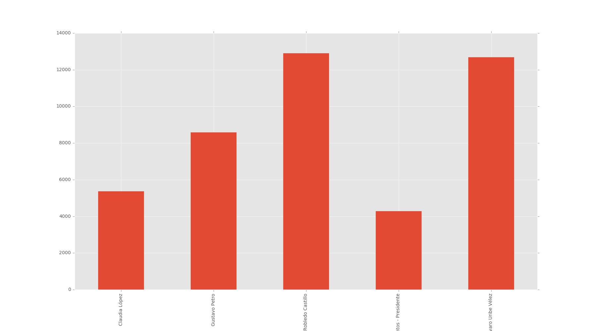
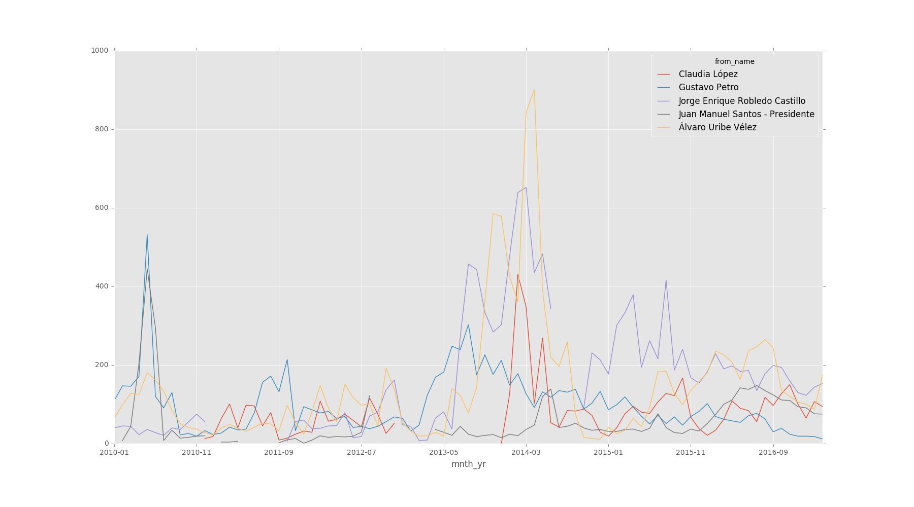

# Proyecto final: Uso Político de Facebook en Colombia
##### David Andrés Valles

## Descripción y motivación
El uso de redes sociales ha crecido exponencialmente en Colombia. Ha permitido una mayor democratización del acceso a la información y al mismo tiempo ha funcionado como una nueva plataforma de propanganda política. Políticos de cualquier rincon del espectro político han aprovechado este espacio para dar a conocer sus plataformas durantes campañas, para dar sus opiniones y lograr una acceso mayor a los votantes. Para este proyecto se piensa analizar 5 políticos colombianos: Juan Manuel Santos, Alvaro Uribe, Enrique Robledo, Gustavo Petro y Claudia Lopez, politicos de diferentes corrientes ideologicas. 

### Preguntas del Proyecto:
- Como ha cambiado el uso de esta red social con el tiempo y en que momentos la usan más?
- Cual es el lenguaje que mas repiten cada uno de ellos? 
- Cuales son los temas de mayor interes?

## Metodo usado
- Uso de R:
 paquete de Rstudio creado por pablo barbera para obtener información (estados, links, fotos, likes) de los usuarios de Facebook por medio del API desde el 2010-1 hasta el 2017-3.
 Se creo un dataframe con información de los 5 políticos y se exporto a python como archivo csv.
 
- Uso de Python:
    - Se uso "pandas" para convertir el archivo en data frame y poder trabajar sobre este
    - Se uso metodos de "pandas", "string", expresiones regulares y "nltk" para poder obtener palabras importantes descartando pronombres,       adverbios, articulo, preposición y conjunción.
## Resultados
Número de publicaciónes en total: 43.905
Número de publicaciones por político:
  Claudia López                       5392
  Gustavo Petro                       8603
  Jorge Enrique Robledo Castillo     12910
  Juan Manuel Santos - Presidente     4306
  Álvaro Uribe Vélez                 12694
  
  
Los publicaciones aumentan en periodos de campaña presidencial

